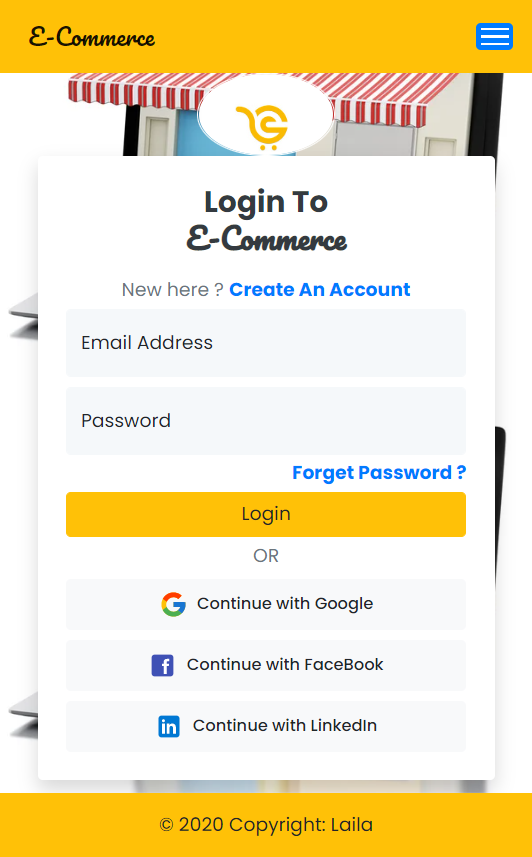
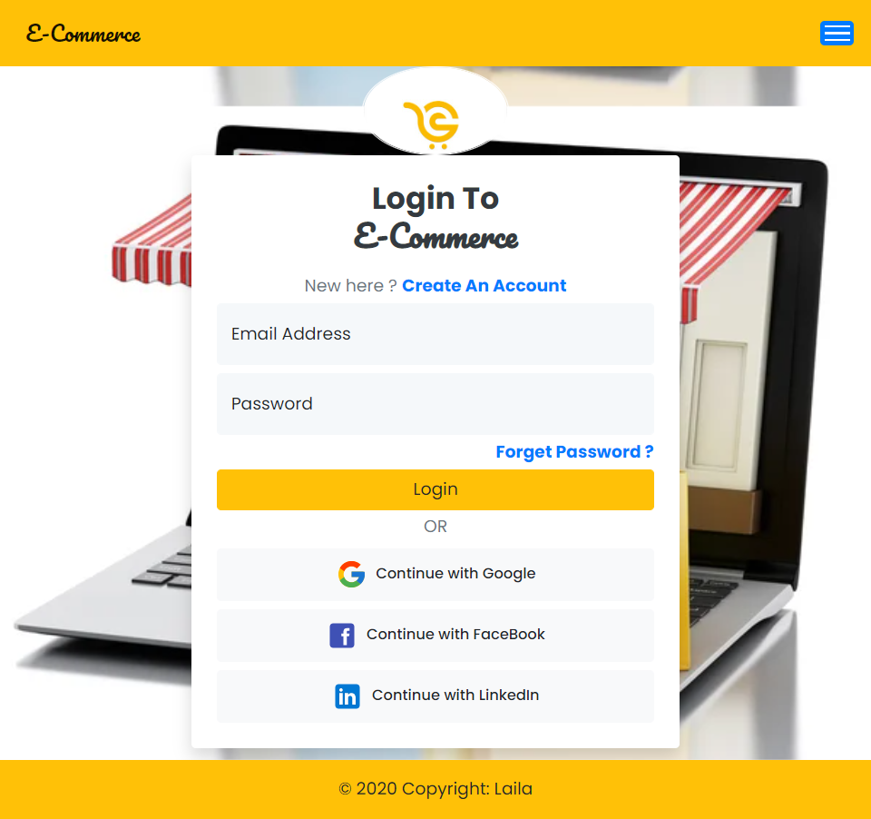
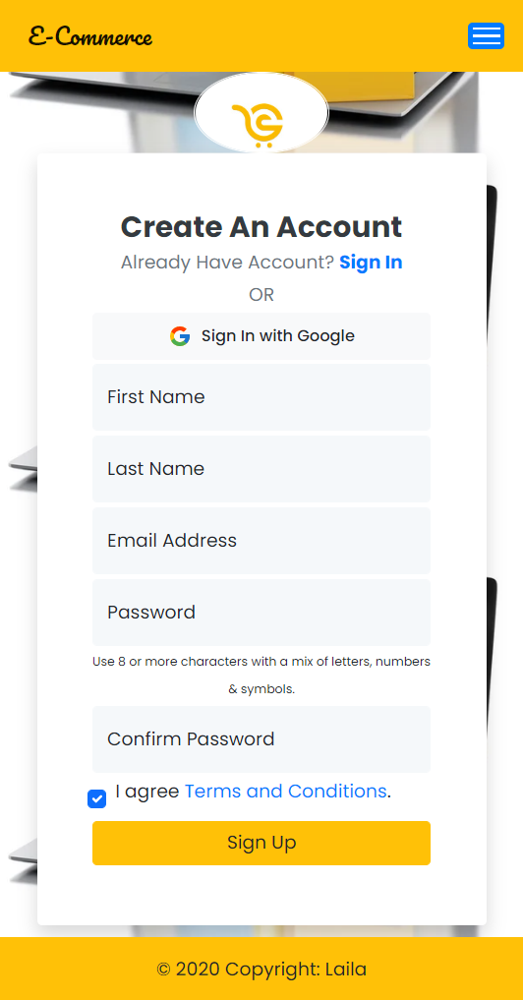
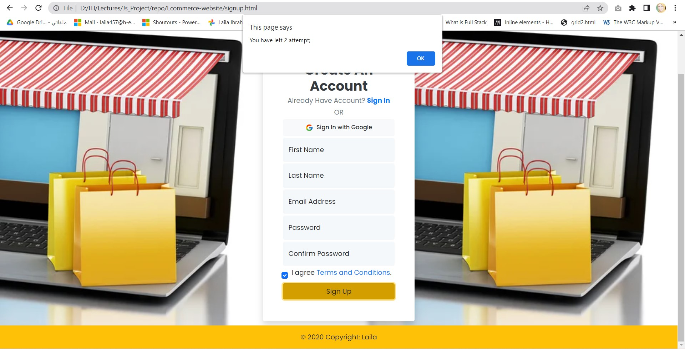
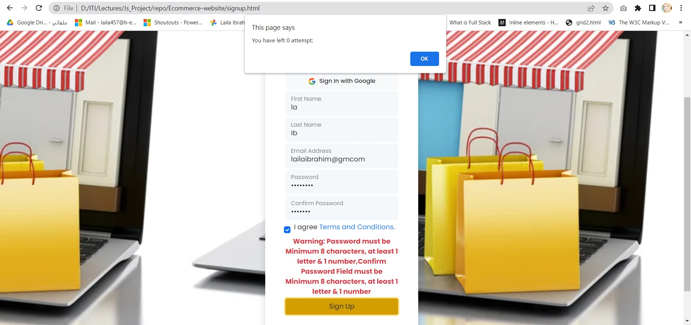

# Ecommerce-website
In general, an e-commerce website allows people to buy and sell physical goods, services, and digital products over the internet rather than at a brick-and-mortar location.

# Build User cycle in signUp and Login:

# First Phase (Design with Html,Css and Bootstrap) ^^:

## Build Responsive Navbar with Bootstrap For Testing:
  1. For User Not SignUp or Login, Mycart  shouldn't appear in the Navbar.
  2. End Navbar.
  
## Build footer for Testing only:
  1. using Sticky position and bottom zero to make footer in the end of the page.

## Build Responsive Login Form with Bootstrap.

## Build Responsive SignUp Form with Bootstrap.

> screenshots for First Phase:
  1. Login Form in Mobile View as in: 
    
  
  2. Login Form in Tablet View as in:
    
  
  3. Login Form in Laptop View (1024px) as in:
    

  4. Login Form in Laptop L View (1440px) as in:
    

  5. SignUp Form in Mobile View as in:
    

  6. SignUp Form in Tablet View as in:
    
 
  7. SignUp Form in Laptop View (1024px) as in:
    

  8. SignUp Form in Laptop L View (1440px) as in:
    
 
## -------------------------------------------------------------------------------------------------------------------------------

# Second Phase (Validate Login and SignUp Forms with Javascript) ^^:

## Validate Login Form With Javascript:
 1. using 3 attempts to login,Every time User try to login an alert will be shown with the no of attempts Now,In the No.3 attempt The Inputs will be disabled. After The Inputs will be Enabled when user refresh the page.

 2. After enter Valid Email and Password, An successful Alert will be shown below login button. Then after 2 seconds, the page will redirect to index.Html.

 > screenshots for Second Phase in Login Form:
 1. When user click on Login Button with Empty Email and Empty Password. First An alert will be shown with The Less No of Attempts as in:
   

  AFter user click Ok of Alert, Then will show Warning before login Input as in:

  

 2. With Empty Email and Invalid Password is enetered, First An alert will be shown with The Less No of Attempts as in:
   

   After User Click ok of Alert, Then will Show warning before Login Input as in:

   

3. With Invalid Email and Valid Password. First An alert will be shown with The Less No of Attempts as in:
   

   After User Click ok of Alert, Then will Show warning before Login Input as in:

   

4. as below, when number of attempts is zero, The Email Input and Password Input will be disabled, and The user can continue only when refresh page.

   

5. and So ON The warning still will be shown Until user Input Valid Email and Valid Password :)

## Validate SignUp Form With Javascript:
 1. using 3 attempts to SignUp,Every time User try to SignUp an alert will be shown with the no of attempts Now,In the No.3 attempt The Inputs will be disabled. After The Inputs will be Enabled when user refresh the page.

 2. After enter Valid Data, An successful Alert will be shown below SignUp button. Then after 2 seconds, the page will redirect to login.html.

 > screenshots for Second Phase in SignUp Form:
 1. When user click on Login Button with Empty Data. First An alert will be shown with The Less No of Attempts as in:
   

  AFter user click Ok of Alert, Then will show Warning before SignUp Input as in:

  

 2. With Valid Email, Valid FirstName, LastName and Invalid Confirm Password & Password is enetered, First An alert will be shown with The Less No of Attempts as in:
   

   After User Click ok of Alert, Then will Show warning before SignUp Input as in:

   

3. With Invalid Email, Invalid FirstName, Invalid LastName and Not Equal Password with Confirm Password. First An alert will be shown with The Less No of Attempts as in:
   

   After User Click ok of Alert, Then will Show warning before SignUp Input as in:

   

4. as below, when number of attempts is zero, The Inputs will be disabled, and The user can continue only when refresh page.

   

5. and So ON The warning still will be shown Until user Input Valid Inputs :)

## -------------------------------------------------------------------------------------------------------------------------------

# Third Phase (Add Users SignUp To localStorage & Login user to SessionStorage & Navbar edits) ^^:
> In SignUp Form:
  1. First we add SignUp User Data After Enter Valid Data as Object to UsersSignUp Array.
  2. Add UsersSignUp Array to localStorage.
  3. redirect The User To Login Page To Login Now.

> In Login Form:
  1. Add Inputs of Login User Data to LoginArray to compare with SignUp Array in localStorage.
  2. by foreach on SignUp Array and Compare Email of LoginArray and Password of LoginArray With All Objects of signUp Array.
  3. if Email & Password Matched with any object in SignUp Array,Session will be stored with Object of user `LoginUser` :) and  successful Alert will be shown in the form . after 2 seconds the page will redirect to index.html :) 

> Edits in Navbar after Authenticate LoginUser:
  1. Using Session Storage, after user successfully login , Show cart with First Name of User In Navbar, Hide Login and SignUp from Navbar and add Logout in Navbar.
  2. If User click on Logout, LoginUser Session will be removed, Hide cart,hide logout , show login and show signUp in navbar :)

  

  
 

